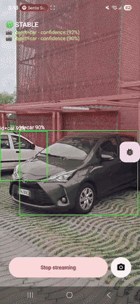
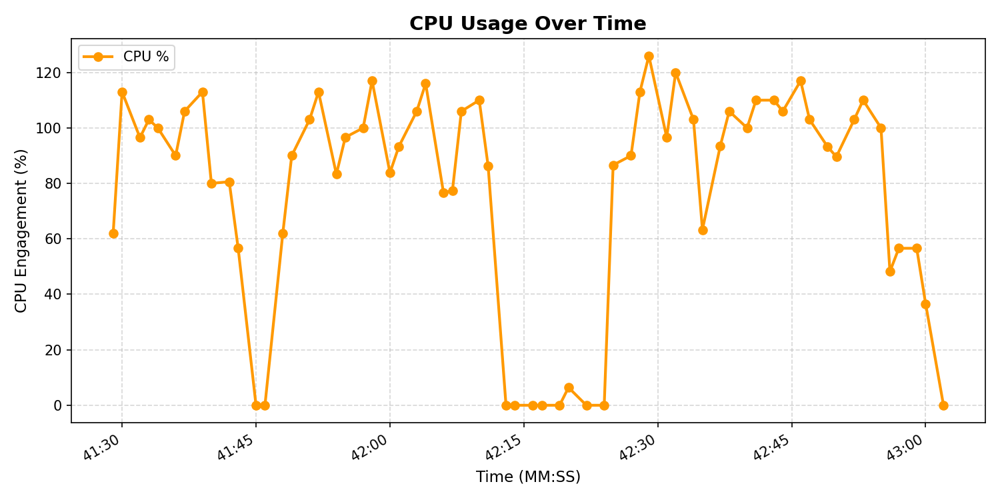
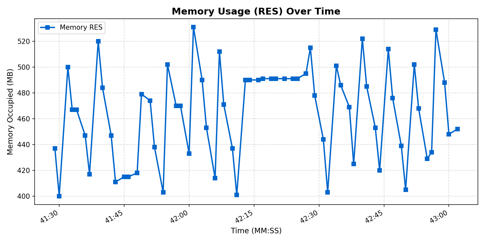

# Camera Access App

>IMPORTANT README ALSO INTO THE ./YOLO DIR OF THE PROJECT

A custom Android application demonstrating integration between the Meta Wearables Device Access Toolkit and mobile Computer Vision models.

The app streams video frames from Meta AI glasses (or a mock device), captures photos, and manages connection states. It also includes a computer vision pipeline connected to the video stream to analyze the scene and trigger an embedded model.

A pre-trained YOLO model performs object detection during stable scenes.

The application is based on the open-source [meta-wearables-dat-android](https://github.com/facebook/meta-wearables-dat-android) codebase.

The YOLO model is pre-trained on the COCO dataset and can detect 80 classes. Model weights and metadata are stored in the app/src/main/assets directory. The model can also be fine-tuned or trained from scratch.

## Features

- Connect to Meta AI glasses
- Stream camera feed from the device
- Capture photos from glasses
- Share captured photos

Something new:

- Streaming scene stabilization aware [ plug in ]
- YOLO obejct detection [ plug in ]

YOLO tested on car class domain because easy to do:
<p align="center">
  
</p>

## Application Architecture

The codebase is based on the *meta-wearables-dat-android* project, with additional plugins integrated.

* The `/assets` directory contains models weights and metadata.
* The directory
  `app/src/main/java/com/meta/wearable/dat/externalsampleapps/cameraaccess/yolo`
  contains the streaming scene stabilization and YOLO inference code.

To integrate the plugins, the following files were modified:

* `MainActivity`
* `/stream/StreamViewModel`
* `/ui/StreamScreen`

All plugin details are described in the `README.md` file inside the `/yolo` directory.
The detected images are stored into the local mobile device file system. In the future this behaviour have to be replace with a Rest call to the 5G inference model.
## Testing, Metrics and Upload

Testing was performed on a Samsung device (`SM_A566B`).

Convert a standard mobile camera video into a mock device-compatible format for testing purposes.
A testing sample is already available in the `/sample` directory of the project.

```bash id="j9s1za"
ffmpeg -i test3.mp4 -c:v libx265 -c:a aac -tag:v hvc1 -vf "scale=540:960" test_mobility2.mov
```

Clone repo:
```bash
git clone https://github.com/TomasConti02/mobile.git
```

Move to the mobile project dir:
```bash
cd ./mobile
```
If needed, upload the generated sample to the mobile device for testing:

```bash id="l2v8nd"
adb push ./sample/video_samples/test_mobility2.mov /sdcard/Download/
```

Create the right local.properties file:
```bash id="l2v8nd"
# create the right 'local.properties' file 
sdk.dir=/PERSONAL_PATH/ANDROID/SDK
github_token=GITHUB_ACCESS_TOKEN_FOR_WEARABLE
```

Check whether an Android device is connected via USB using:

```bash id="m9jv6p"
adb devices -l
```
Build and install the APK on the connected device with:

```bash id="b6c1tk"
./gradlew clean installDebug
```


Additional runtime metrics were collected directly from the device using the `top` command to monitor the application process:

```bash id="z9fj2p"
while true; do 
  echo "$(date '+%Y-%m-%d %H:%M:%S') $(adb shell top -b -n 1 | grep "com.meta.wearable.dat.externalsampleapps.cameraaccess")" >> performance_log.txt
  sleep 1
done
```

During the stream processing phase, CPU cores (one core needed) utilization increases due to streaming operations and motion detection execution. Runtime analysis did not show critical CPU spikes.

Once the stream is stopped, CPU usage drops significantly because streaming and motion detector execution are no longer active.

Monitoring of the CPU core utilization for the modified application with `MotionDetector.kt` enabled.

<p align="center">
  
</p>

Monitoring of the original application process without the `MotionDetector.kt` component.

<p align="center">
  
</p>

The comparison shows that the `MotionDetector.kt` computer vision component does not significantly increase CPU core utilization. The solution remains stable and maintains good runtime performance during stream processing.


<p align="center">
  
</p>

Memory allocation metrics were also collected using the Android Studio Profiler during activation of the stream detection feature.

Since the model is eagerly loaded into memory during startup, the memory graph shows only a minimal increase during inference execution. The profiler graphs also help identify which components are responsible for memory allocation.

<p align="center">
  
</p>

>Additional analysis with Android Studio Profiler did not reveal critical thread blocking or abnormal sleeping states.

## /MainActivity

Application entry point. The app uses a single activity running on the main/UI thread, since graphics libraries are not thread-safe and require direct UI access. No activity-switching intents are used.

`MainActivity` handles:
* runtime permission checks
* Meta AI access
* eager model initialization

The model is initialized at startup because loading weights into the mobile GPU is an I/O-intensive blocking operation.

## /stream/StreamViewModel

This component acts as the view model of the application and manages the embedding and execution flow of the computer vision model.

The frame stream is filtered through a `MotionDetector.kt` component, while the YOLO inference triggering logic is handled inside the `StreamViewModel.kt`.

Stopping the stream is a critical operation and is handled carefully to avoid buffering issues and race conditions. A frame channel is used to continuously overwrite and keep only the latest valid frame for monitoring and analysis. Once the monitor detects a stable scene, the YOLO inference process is launched.

All state changes and inference results are propagated back to the UI, ensuring that the view is updated reactively.

## /ui/StreamScreen

Since the application uses a single activity, UI state changes are managed following the Jetpack Compose architecture.
The interface is dynamically updated through `@Composable` functions, following the principle:

UI = f(state)

Additional components such as `streamViewModel.x.collectAsStateWithLifecycle` were added to observe and collect data from the `StreamViewModel.kt` in a lifecycle-aware way.

