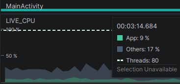
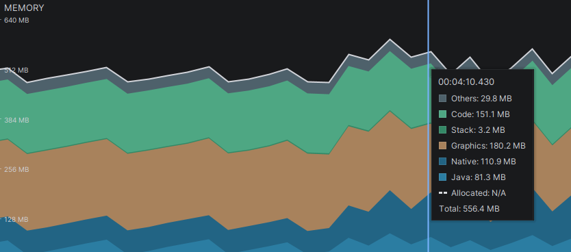

# Camera Access App

A custom Android application demonstrating integration between the Meta Wearables Device Access Toolkit and mobile Computer Vision models.

The app streams video frames from Meta AI glasses (or a mock device), captures photos, and manages connection states. It also includes a computer vision pipeline connected to the video stream to analyze the scene and trigger an embedded model.

A pre-trained YOLO model performs object detection during stable scenes.

The application is based on the open-source [meta-wearables-dat-android](https://github.com/facebook/meta-wearables-dat-android?utm_source=chatgpt.com) codebase.

The YOLO model is pre-trained on the COCO dataset and can detect 80 classes. Model weights and metadata are stored in the app/src/main/assets directory. The model can also be fine-tuned or trained from scratch.

## Features

- Connect to Meta AI glasses
- Stream camera feed from the device
- Capture photos from glasses
- Share captured photos

Something new:

- Streaming scene stabilization aware [ plug in ]
- YOLO obejct detection [ plug in ]

 
 
## Application Architecture

The codebase is based on the *meta-wearables-dat-android* project, with additional plugins integrated.

* The `/assets` directory contains models and metadata.
* The directory
  `app/src/main/java/com/meta/wearable/dat/externalsampleapps/cameraaccess/yolo`
  contains the streaming scene stabilization and YOLO inference code.

To integrate the plugins, the following files were modified:

* `MainActivity`
* `/stream/StreamViewModel`
* `/ui/StreamScreen`

All plugin details are described in the `README.md` file inside the `/yolo` directory.
## Testing and Metrics

Check whether an Android device is connected via USB using:

```bash
adb devices -l
```

Build and install the APK on the connected device with:

```bash
./gradlew clean installDebug
```

Testing was performed on a Samsung device (`SM_A566B`).

CPU and memory metrics were collected using the Android Studio Profiler.

<p align="center">
  
</p>

<p align="center">
  
</p>


## /MainActivity

Application entry point. The app uses a single activity running on the main/UI thread, since some libraries are not thread-safe and require direct UI access. No activity-switching intents are used.

`MainActivity` handles:
* runtime permission checks
* Meta AI intent validation
* eager model initialization

The model is initialized at startup because loading weights into the mobile GPU is an I/O-intensive blocking operation.

## /stream/StreamViewModel

This component acts as the view model of the application and manages the embedding and execution flow of the computer vision model.

The frame stream is filtered through a `MotionDetector` component, while the YOLO inference triggering logic is handled inside the `StreamViewModel`.

Stopping the stream is a critical operation and is handled carefully to avoid buffering issues and race conditions. A frame channel is used to continuously overwrite and keep only the latest valid frame for monitoring and analysis. Once the monitor detects a stable scene, the YOLO inference process is launched.

All state changes and inference results are propagated back to the UI, ensuring that the view is updated reactively.

## /ui/StreamScreen

Since the application uses a single activity, UI state changes are managed following the Jetpack Compose architecture.
The interface is dynamically updated through `@Composable` functions, following the principle:

UI = f(state)

Additional components such as `streamViewModel.x.collectAsStateWithLifecycle` were added to observe and collect data from the `StreamViewModel` in a lifecycle-aware way.

